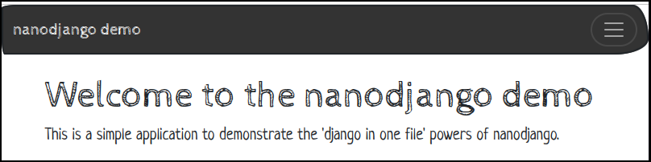

# Django in one file Demo


## Overview
This project explores the ideas of having an entire [Django](https://www.djangoproject.com/) project in a single file, internally the result will be a Django project but externally it will be more like a [Flask](https://flask.palletsprojects.com/en/3.0.x/) project. 

In it's inital form it's based on the [nanodjango project](https://github.com/radiac/nanodjango).

## Use of Environmental Variables
Secrets are kept in environmental variables. 

The use of the [direnv utility](https://direnv.net), in conjunction with a .envrc file, results in the environmental variables being autoloaded when the current directory is the project root (or child directories of that). 

The .envrc file is not committed to the repos but the .envrc_TEMPLATE file, which is committed, provides guidance on what should appear in the .envrc.

## Regenerating Django Secret Key
```
python -c 'from django.core.management.utils import get_random_secret_key; print(get_random_secret_key())'
```

# Static Analysis
Static code analysis is done using [flake8](https://flake8.pycqa.org/en/latest/#).

## Executing the analysis

A `.flake8` configuration file controls how flake8 behaves, amongst other thing this configuration file allows some warnings to be suppressed and this is sometimes an appropriate action.

Execute the following from the project root directory.

```default
$ flake8 ./
```

